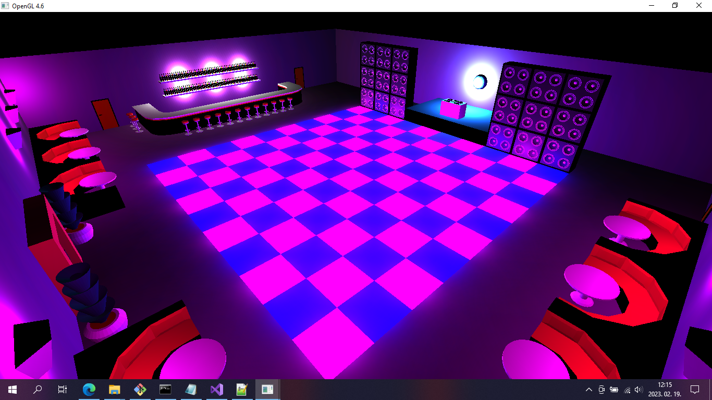

<h1>Nightclub-Scene</h1>

A simple nightclub scene I made for a college assignment using C++ and OpenGL in Visual Studio. It has deferred lighting using an FBO.

How to run:
1. Open the command line and type: subst t: path\to\Nightclub-Scene\04_Deferred\includes
2. Build and run the project in Visual Studio.
3. The program will run from the IDE but it's also executable under Nightclub-Scene\x64\Debug
4. To delete the virtual T: drive, go back to the command lineand type: subst \D t:

Controls:
<ul>
<li>Hold left mouse button and drag it to rotate the camera.</li>
<li>Use WASD to move the camera forward, left, right and back.</li>
</ul>

Copyright notice: This project was made using the OGLBase framework which is owned by ELTE's Department of Computer Science, therefore monetizing it is forbidden.
